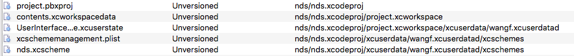

# what is
Markdown 是一种轻量级标记语言 
# how to use 
## 标题 
文本前面加上#即可，一个＃是一级标题，两个＃是二级标题。
## 断落 
第一段。（分段落是四个空格）。    
第二段。
## 强调 
**粗体**    
*斜体*    
***倾斜加粗***    
~~删除线~~
## 列表 
* 列表1
* 列表2
* 列表3
- 列表1
- 列表2
- 列表3
1. 列表1    
2. 列表2    
3. 列表3

## 链接 
- 外部链接：[内嵌式链接](https://www.baidu.com)
- 内部链接1：链接仓库的其他文件：[notices](notices.txt)
- 内部链接2：链接其他仓库的文件：[readme](https://github.com/havenow/hello-world/blob/master/README.md)
- 内部链接3：链接本文档中的其他部分: [列表](README.md#断落)
- 引用式链接：[引用式链接]

## 图片 
- 外部图片    
    
- 仓库内的图片


## 引用
> 让暴风雨来的更猛烈些吧

## 代码块 
- 代码块
```c++
  pubic int main(int args, char** argv)
  {
    return 0;
  }
```
- 行内代码 
行内的代码 `strcpy(strDes, strSrc);`

# reference
- [简书：献给写作者的 Markdown 新手指南](http://www.jianshu.com/p/q81RER)

<!-- 下面是本文用到的链接 -->
[引用式链接]: https://www.baidu.com
